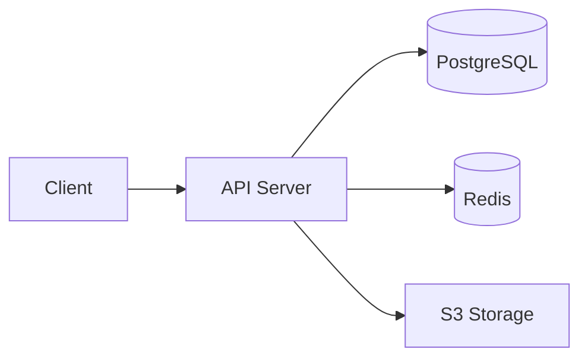
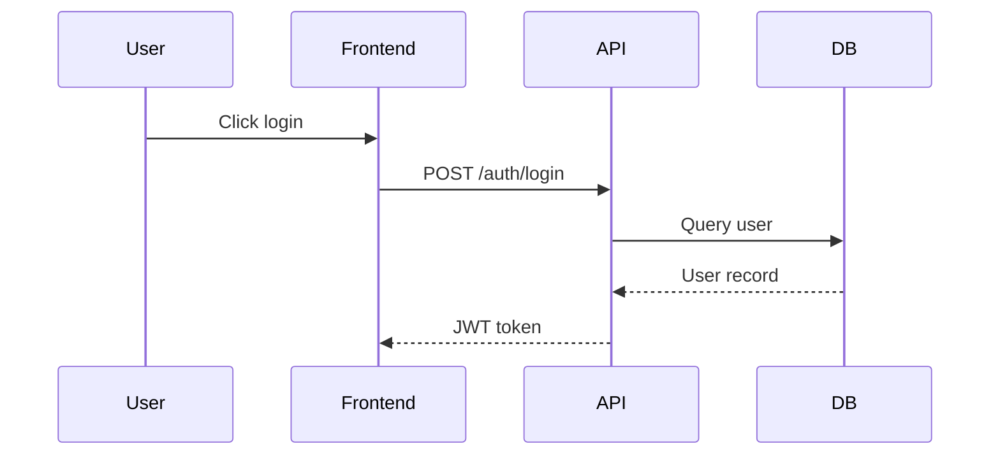
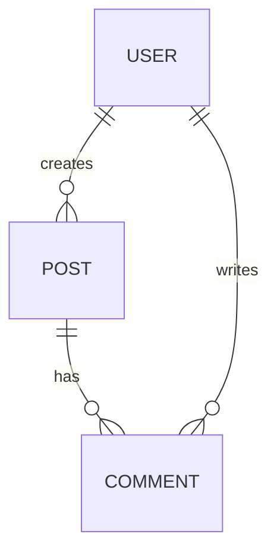

# Forge Diagram — Mermaid Architecture Diagrams

Generate technical diagrams in Mermaid syntax based on the codebase and KB.

## Input

The user provides: `$ARGUMENTS`

If no arguments, ask: "What do you want to diagram? (e.g. system architecture, auth flow, data model)"

## Diagram Types

### 1. System Architecture (`flowchart`)
High-level view of services, databases, external APIs.


### 2. Request Flow (`sequenceDiagram`)
How a request flows through the system.


### 3. Data Model (`erDiagram`)
Database schema and relationships.


### 4. Module Dependencies (`flowchart`)
How code modules relate to each other.

### 5. State Machine (`stateDiagram-v2`)
Task/spec lifecycle, user states, order states.

### 6. Deployment (`flowchart`)
CI/CD pipeline, infrastructure.

## Process

### 1. Read Context
- Read `.forge/kb/architecture.md` for stack info
- Scan codebase structure with Glob
- Read key files (models, routes, config) with Grep

### 2. Generate Diagram
- Choose the right Mermaid diagram type for what was requested
- Keep it readable — max ~20 nodes per diagram
- Use clear labels, not file paths
- Group related nodes with subgraphs

### 3. Save to KB
Write the diagram to `.forge/kb/architecture.md` under a `## Diagrams` section, or create a dedicated `.forge/kb/diagrams.md` if there are multiple.

Format:
````markdown
## System Architecture


````

### 4. Offer Variants
After generating, offer:
- "Want me to add a sequence diagram for a specific flow?"
- "Should I diagram the database schema too?"

## Rules

- **Scan the real code.** Don't invent services that don't exist.
- **Keep diagrams focused.** One concept per diagram.
- **Use subgraphs** for grouping (Frontend, Backend, Infrastructure).
- **Label edges** with what flows through them (HTTP, events, queries).
- **Save to KB** so diagrams are part of the project context.
